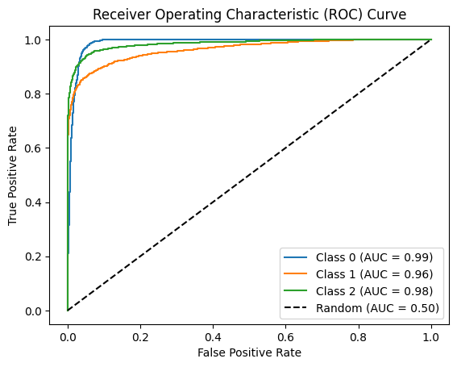
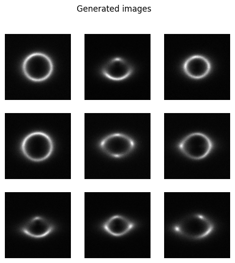
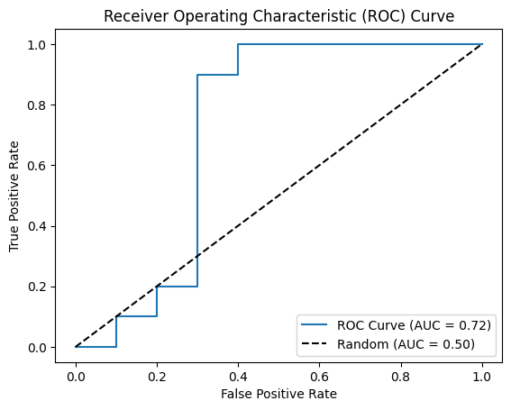
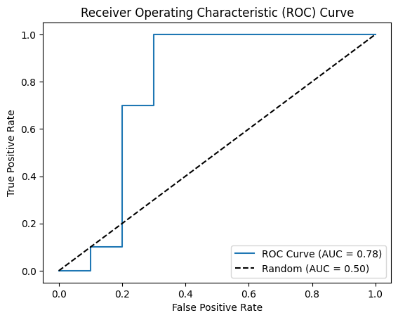
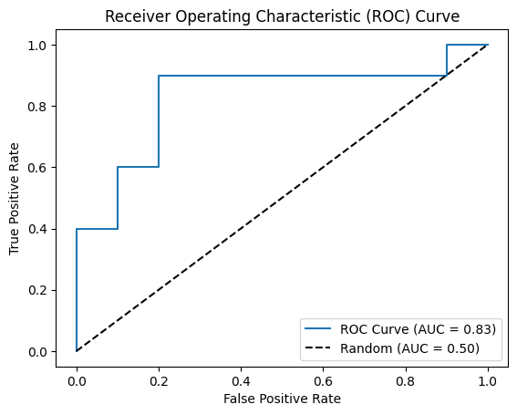

# ML4SCI GSOC 2024 Application

This repository contains my submission for the ML4SCI program application for Google Summer of Code (GSOC) 2024. It includes solutions to the following tests:

## Common Test 1
The Common Test 1 folder contains my solution and related files for the first common test in the ML4SCI application process.

### Results:
ROC AUC values:

Class 0 ROC AUC: `0.9879`

Class 1 ROC AUC: `0.9626`

Class 2 ROC AUC: `0.9842`

ROC AUC curve:

## Specific Test 4 - DDPM Model
The Specific Test 4 - DDPM Model folder contains my solution and related files for the fourth specific test, focused on Denoising Diffusion Probabilistic Models (DDPMs).

### Results:
FID score: `15.42`

Some images generated from the model:

## Specific Test 6 - Self-Supervised Learning
The Specific Test 6 - Self-Supervised Learning folder contains my solution and related files for the sixth specific test, Learning Representation Through Self-Supervised Learning on Real Gravitational Lensing Images.

### Results (ROC AUC values):
- Baseline (Supervised): `0.72`

- Contrastive Learning (Self Supervised): `0.77`

- SimSiam Networks (Self Supervised): `0.83`

Please refer to the individual folders for more details on each solution. If you have any other questions about my submission, feel free to reach out!

Arjun Dosajh
IIIT Hyderabad